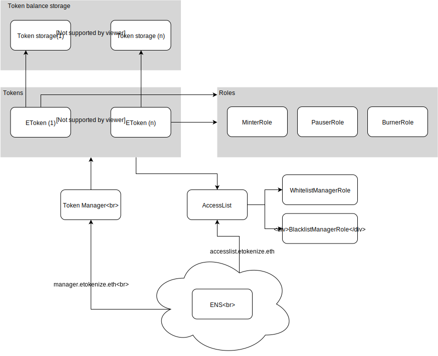

# TokenX - an [eToro](https://www.etoro.com/) stablecoin
[](https://circleci.com/gh/eTokenize/TokenX) [](https://coveralls.io/github/eTokenize/TokenX)

TokenX is stablecoin implementation by [eToro](https://www.etoro.com/) targeting the [Ethereum](https://www.ethereum.org/) platform.

## USAGE
To test the library and setup the development environment, issue the following commands in a shell:
```shell
  yarn install
  yarn test # compile and test
```

### Prerequisites
You need to have [`yarn`](https://yarnpkg.com/) and [`node`](https://nodejs.org/) installed.
This repository has only been tested on UNIX-derived systems.

## OVERVIEW


### TokenX - ERC20
#### External Storage

### Accesslist
#### Whitelist - KYC
#### Blacklist

### Token Manager

## FILES
Path | Description
------------- | -------------
`contracts/` | All the solidity files making up the implementation
`contracts/token` | Contains the TokenX implementation
`contracts/token/ERC20` | ERC20 implementation using an external storage
`contracts/roles` | Defines the roles implementation, i.e. whitelisting, blacklisting, miners etc.
`contracts/lifecycle` | Implements lifecycle behaviors. Taken from OpenZeppelin
`contracts/mocks` | Contracts used specifically for testing purposes
`test/`  | Contains testing code in JavaScript
`scripts/` | Specific scripts for testing, coverage & upgrading tokens

## LICENSE