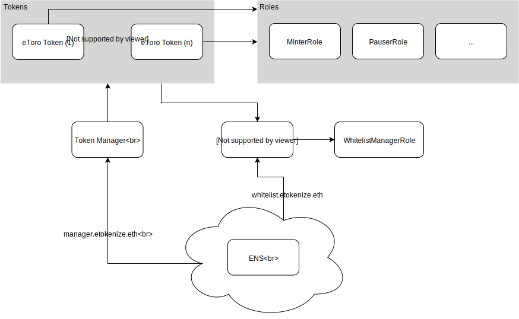

# eToken design overview

*__Figure 1:__ Design overview. To simplify the overview, aspects
related to the token upgrading functionality are not shown here but
are described separately in Figure 4.*

## eToken - ERC20
This document describes the design and implementation of the smart
contracts comprising eToken which is intended to be used for powering
several different stablecoins representing various assets. At its
core, eToken is an ERC20 token with additional supporting
infrastructure relating to token management, permission management and
token upgradability. The remainder of this document gives a high-level
overview of the design and implementation of the token itself and its
supporting infrastructure.

Initially, we intended to base our implementation entirely on the
OpenZeppelin (OZ) solidity library and extend from its unmodified
ERC20 implementation. However, we found that implementing a number of
our desired features was impossible without modifying the underlying
OZ code. Therefore, our current implementation contains several
modified and extended OZ components. When modifying OZ components, we
have attempted to retain major design decisions and making
non-intrusive and predictable code alteration.

### System design
An overview of the design is shown in Figure 1 and a detailed diagram
of the interfaces of the various components is shown in Figure 4. The
components of the shown design serves following purposes:

 * The TokenManager acts as a registry of currently deployed
   tokens. Its primary purpose is to serve as am on-chain registry of
   the tokens currently deployed which can be queried by clients.
 * The AccessList contract holds the access list which comprises a
   whitelist containing KYC’d addresses and a blacklist containing the
   list of addresses which are prevented from accessing the
   tokens. The blacklist shadows the whitelist such that an address
   can be temporarily blacklisted without altering the whitelist.
 * The Ethereum Name System (ENS) is used to allow frontends to
   identify (possibly changing) contract addresses through a constant
   name.
 * eToken(n) are ERC20 tokens which uses an ERC20 implementation
   extended from the OpenZeppelin library to enable the use of an
   separate contract for storing balances and allowances. The need for
   this separation was driven by our requirement of being able to
   upgrade the tokens. We discuss the token implementation itself in
   the following section.

### Internal token design

The eToken design features a well-defined separation of concerns and a
streamlined control flow. This was achieved by dividing the design
into four layers, each with a clearly defined responsibility. The
layers are depicted in Figure 2 and described after this paragraph. An
additional goal of this refactoring was to avoid overriding several
`public` functions with functions of the same name. With this, we aim
to minimize the risk that a function is unintentionally exposed.

 * The **Interface layer** implements the public interface of an
   EToken as defined by `IEToken`. If an upgraded token is called, the
   call is forwarded to the proxy interface of the token next in the
   chain of upgrades. If the token is not upgraded, the call is
   forwarded internally to the access-control wrappers in the
   `ETokenGuarded` contract. At this point, the initial `msg.sender`
   property is captured and passed as an explicit sender parameter to
   subsequent function calls.
 * The **Proxy layer** implements the chaining of calls through
   multiple generations of upgraded tokens. All functions implemented
   here are defined by the `IEtokenProxy` interface. All upgrade
   targets must implement this interface. When the chain of calls
   eventually reaches the currently active token, the call is forwarded
   to the appropriate function in the `ETokenGuarded` contract. The
   functions exposed by this layer are `public`, but they are only
   callable by their immediate parent.
 * The **Access control** layer implements wrappers around internal
   functions which enforce access control using the access control and
   KYC (whitelist/blacklist) contracts. All access control checks
   which are performed on the request sender use the explicit sender
   parameter passed down from `EToken`. The wrappers are implemented
   in the `ETokenGuarded` contract.
 * In the **ERC20 functionality layer** the functionality comprising
   an ERC20 token is implemented. This functionality is now only
   exposed through internal functions which are wrapped by the outer
   layers.

As a rule of thumb, the public functions exposed from the token are
defined in the `IEToken` interface and implemented by the `EToken`
contract. However, exceptions were made for administrative functions
which are not threaded through the upgrade machinery. Examples of such
are functions for managing permissions and roles.

**Figure 2:** The layers comprising the new token design. The layers
are arranged bottom-up from outmost to innermost.

### Upgradability and external storage ERC20 implementation
Due to the immutability of Ethereum smart contracts, upgrading the
functionality of a previously deployed contract is a well known
challenge. The strategy we use for upgrading previously deployed
tokens are similar to, eg., TrueUSD and Tether USD and works by
allowing the functions comprising the external interface of a token to
which modes such that they proxy all calls to a new contract. In
particular, the following is achieved.

 * Token upgrades are transparent to the user and will not interrupt
   the operation of the previously deployed tokens.
 * By separating token balances from token functionality, upgrades are
   cheap, since no data needs to be moved.

### External ERC20 storage
A prerequisite for making our token upgradable was to build an ERC20
implementation which held token balances and allowances in a separate
and dedicated contract. To do this, we extended the OZ ERC20
implementation to make it call an external storage contract for every
operation modifying or querying token balances and allowances. The
storage contract is quite simple and supports a minimal set of
operations. In order to prevent multiple tokens from, accidentally or
intentionally, using the same storage, the storage contract will only
accept requests from a single contract at a time. This contract is
known as the implementor. When a token is upgraded, the implementor of
the attached storage is transferred to the new token.

  

*__Figure 3:__ Rendering of the token upgrade process. On the left
side, we see the contract communications before the network
upgrade. All clients and the token manager targets the token
contract. The token contract use a separate contract for storing
balances. On the right side, the contract organization after an
upgrade is shown. The token manager is updated to point to the new,
upgraded, contract. The old contract is marked as deprecated which
causes it to proxy all incoming calls to the new contract. The balance
storage contract now provides storage for the new token contract such
that balances are transferred seamlessly.*

### Token upgrade
In order to make the token upgradable all calls initially targets a
proxy contract which inherits from the contract implementing the token
functionality. When a non-upgraded token is called directly, the
execution flow continues internally along a superclass function. When
an upgraded contract is called, it makes an external call to the
corresponding function in the new contract. The challenge now is, that
when the new contract retrieves the call, msg.sender points to the
upgraded contract rather than the original sender. In order to get
around this, the new token is required to provide a set of functions,
accepting an explicit sender parameter, which can be used as the entry
point for the proxy calls. In order to prevent abuse of these
functions they can only be called by the upgraded (old) contract. The
security of this system relies on the fundamental assumption that the
old contract cannot be compromised in a way which allows the sender
addresses it sends to the new contract to be compromised. The upgrade
process is depicted in Figure 4.

## Permission management

### Hierarchical roles
The owner of the contracts has complete control and can perform all
operations. Being all-powerful, it is essential that the owner account
gets as little exposure as possible. Therefore, we separate day-to-day
management tasks into fine-grained roles which accounts can be
assigned to as needed. Note that these permissions are assigned on a
token-by-token basis. We define the following roles:

 * MinterRole can mint new tokens
 * BurnerRole can burn tokens
 * PauserRole can temporarily pause a token, preventing new
   transactions
 * WhitelistAdminRole can add and remove accounts to and from the
   whitelist contained in the AccessList.
 * BlacklistAdminRole can add and remove accounts from the blacklist
   part of the AccessList

The implementations of these roles are mostly identical to the
corresponding roles provided in the OpenZeppelin library. However,
since the OZ implementations did not fulfill our needs we had to
provide our own, slightly altered, implementations. In the OZ
implementation of the role contracts, a permission can only be granted
to an account by another account holding the same permission (e.g.,
only a minter can add other minters), and accounts can only be removed
by permission holders renouncing their own privilege. This was not
acceptable for us, as we need a hierarchical permission structure with
more centralized control. Therefore, we have altered the OZ roles as
follows:

 * All role contracts were made Ownable
 * Functions enabling the owner to revoke permissions from an account
   were added
 * Functions for granting permissions to an account were made
   owner-only

Furthermore, since the roles are tightly integrated in the
OpenZeppelin system, modifying otherwise unrelated parts of OZ to use
our roles, such as lifecycle/Pausable, was unfortunately unavoidable.

## Accesslist
Access to token transfer functions is guarded by the
AccessList. Accounts can be given access (whitelisted) when they have
passed a KYC check and abusive accounts can be blacklisted temporarily
or permanently. AccessList is implemented separately from the
previously described roles for the following reasons:

1. It is always shared between all the tokens. That is, once a
   customer is KYC’d, we allow them to trade all of our tokens. The
   aforementioned roles, on the other hand, may be limited to a
   specific token. For example, different accounts may be responsible
   for minting USD and gold tokens.
2. The AccessList contains a large number of addresses and it is
   impractical to require that this data is transferred if we need to
   upgrade the token contracts.

## Restricted Minting
In order to limit the damage which can be caused by a compromised
minter account, we have implemented the concept of a restricted
minting. In restricted minting, a minter is only allowed to mint to a
predetermined account which is specified by the owner. This prevents
an attacker from minting new supply directly to their account, since
new supply can only be minted to the dedicated minting account and is
subsequently transferred to its final destination as an independent
action.

## Class Diagram

*__Figure 4:__ Detailed interactions of the contracts*
